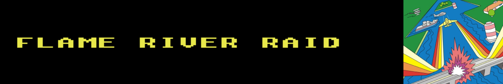
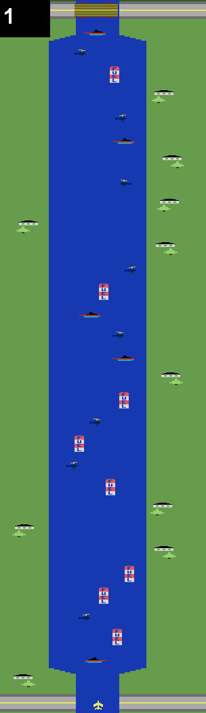
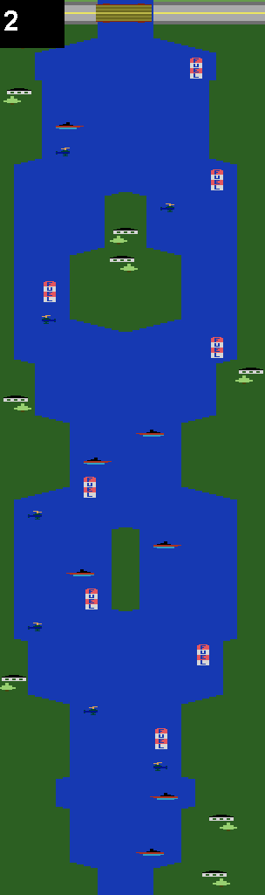
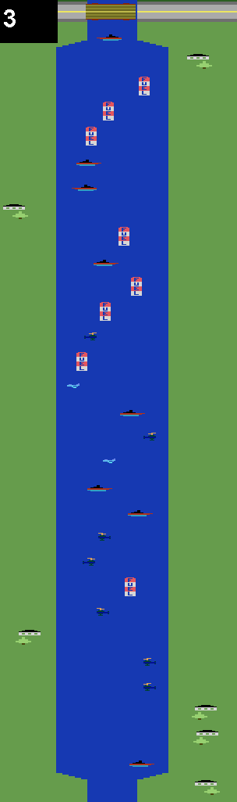
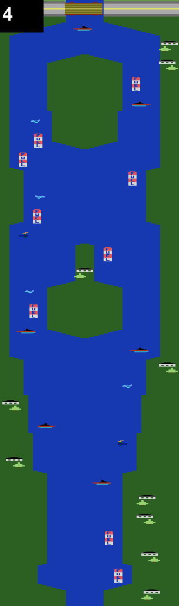

Criado por Carol Shaw, em Dezembro de 1982, pela Activision, para o Atari 2600, River Raid é um jogo ambientado em um cenário de guerra, onde o jogador, ao comando de um avião de caça, precisa destruir inimigos como barcos, aviões e helicópteros, evitar choque com pontes, desviar de morros e colinas e cuidar do reabastecimento do combustível do avião.

River Raid foi um jogo que marcou época devido aos detalhes gráficos e a variação de cores, permitindo perceber claramente o que está na tela, diferentemente de outros jogos em que o jogador era apenas "pontinhos", exigindo um exercício de imaginação e abstração.

Além disso, outras inovações que tornaram o River Raid um jogo único para  a sua época foram: 
  - variedade dos cenários
  - jogabilidade vertical, até então inédita
  - clareza dos inimigos como barcos, helicópteros e aviões, que se movimentam aleatoriamente
  - jogabilidade fluída, com diferentes níveis de velocidade
  - detalhes como a perda de combustível e a necessidade de reabastecimento
  - introdução do conceito de <i>checkpoint</i>, em que ao morrer, o jogador reinicia o game a partir da última ponte destruída.

  O jogo vendeu mais de um milhão de cópias oficiais, sem contar as inúmeras versões piratas, ganhou vários prêmios e rendeu a Carol Shaw um cartucho de platina no jogo, além de abrir portas  para as mulheres na indústria de jogos.

  ## Tecnologias/bibliotecas

  As tecnologias/bibliotecas utilizadas na construção do jogo foram:

  <table>
    <tr><th>Toolkit </th><th>Produção </th><th>Desenvolvimento</th></tr>
    <tr><td>

|| Versão|
|:------------:|:--|
|**flutter**| 3.24.3 |
|**dart**| 3.5.3 |

</td><td>

|Biblioteca| Versão|
|:------------:|:--|
|**audioplayers**| 5.2.1 |
|**flame**| ^1.19.0 |
|**flame_texturepacker**| ^4.1.0 |
|**flame_tiled**| ^1.20.3 |
|**flutter_native_splash**| ^2.4.1 |
|**flutter_soloud**| 2.0.2 |
|**intl**| ^0.19.0 |

  </td><td>

|Biblioteca| Versão|
|:------------:|:--|
|**flutter_lints**| ^5.0.0 |
|**custom_lint**| ^0.6.5 |
|**pyramid_lint**| ^2.0.1 |
|**flutter_launcher_icons**| ^0.14.1 |

  </td></tr>
  </table>

 ## O projeto

  Esse projeto apresenta uma implementação do River Raid usando o [Flame](https://docs.flame-engine.org/latest/), uma biblioteca para o Flutter voltada para o desenvolvimento de jogos.

  Essa implementação não é uma espécie de "casca" que roda o jogo original e nem uma portabilidade propriamente dito, apesar do esforço em manter a mesma atmosfera e essência.

  O jogo foi escrito do zero, usando a linguagem Dart, utilizando classes, métodos, funções e propriedades disponíveis pelo Flame. 

  ## Mapas

  O jogo não é tão longo quanto o original, pelo contrário, é bem curto. Atualmente conta com 4 mapas jogáveis e um último apenas comemorativo (é o mapa 1, mas sem os inimigos e postos de reabastecimento e com fogos de artifício), como uma espécie de final de jogo.
  
  Os mapas foram construídos usando o programa [Tiled](https://www.mapeditor.org/), a partir das imagens retiradas do jogo original, incluindo o posicionamento dos inimigos, dos postos de reabastecimento e mapeamento das montanhas e colinas.

  As figuras abaixo ilustram as imagens dos mapas utilizadas na confecção do jogo.

  

     
    
    
    
  

  É muito provável que o jogo ganhe alguns outros mapas futuramente.

  ### Transição de mapas

  Para permitir que o jogo seja escalonável, ou seja, que outros mapas sejam acrescentados no jogo, mas sem compromenter o desempenho, os mapas não são todos  carregados na memória de uma só vez. O funcionamento ocorre da seguinte forma: 
  
  - o jogo começa carregando somente o mapa corrente, de início ou reinício do jogo
  - um pouco antes de visualizar a ponte que acessa o mapa seguinte, o jogo carrega na memória o respectivo mapa, tornando-o visível ao jogador
  - ao passar da ponte e o mapa antigo sumir da visão do jogador, esse mapa é retirado da memória.

  Ou seja, o jogo não ultrapassa o limite máximo de dois mapas carregados na memória simultâneamente, tendo um mapa carregado até a visualização de sua respectiva ponte, quando passamos a ter dois mapas carregados, até que a ponte seja ultrapassada, retirando da memória o mapa que ficou para trás, passando a ter novamente apenas um mapa carregado.
  
  ## Sprites

  O avião de caça, os inimigos, efeitos de explosão, áudios, fonte e demais sprites foram retirados de projetos disponibilizados no github e em sites específicos de assets, que serão devidamente referenciados no final.

  ## O Jogo

  https://github.com/user-attachments/assets/d0b5a3c3-676f-4a7f-8edb-1ce7709ba90d

https://github.com/user-attachments/assets/28e52f7e-6b67-41f8-9341-76c1f92ae634

https://github.com/user-attachments/assets/e4eca2a8-498e-4287-bfd5-6140d86faa34
  
  ## Assets

   - [Mapas do jogo original](https://www.vgmaps.com/Atlas/Atari2600/RiverRaid-Map.png)
   - [Fonte](https://juanitogan.itch.io/river-raid-squadron)
   - Áudios
     - [reabastecimento, pouco combustível e sem combustível ](https://github.com/athaless/RiverRaid/tree/main/sons)
     - [fogos de comemoração (atari_boom2.wav)](https://opengameart.org/content/atari-booms)
     - [demais áudios](https://github.com/MBrosik/river-raid/tree/main/src/audio)
  - Sprites
    - [joystick e botão](https://verzatiledev.itch.io/ui-switch-controller)
    - [explosões e marcador de combustível](https://www.spriters-resource.com/atari/riverraid/sheet/4176/)
    - [fogos de artifício](https://opengameart.org/content/fireworks-effect-spritesheet)
    - [demais sprites](https://github.com/MBrosik/river-raid/tree/main/src/images)
  - [Abertura do jogo](https://br.pinterest.com/pin/23714335519884198/)

  ## Importante

  Este jogo não está disponível em nenhuma loja de aplicativos (Apple Store, Google Play), tampouco é um projeto comercial, sendo apenas um projeto de estudo. Portanto não há intenção alguma em obter vantagens financeiras com o uso dos assets citados acima.